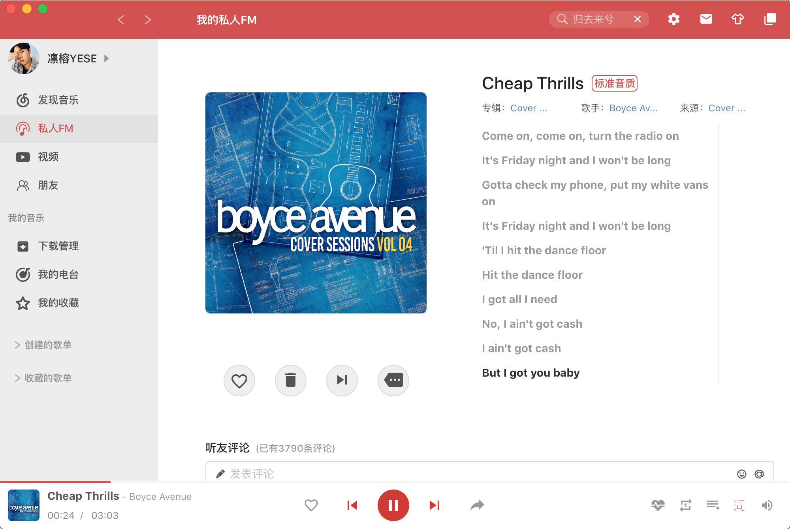
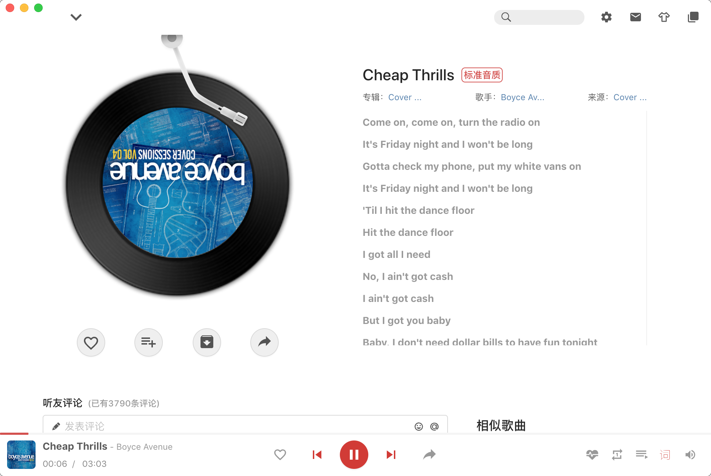

#### #NoteMusic

**技术栈**

- [Electron](https://electronjs.org/)
- [electron-vue](https://simulatedgreg.gitbooks.io/electron-vue/content/cn/) 
- [electron-builder](https://www.electron.build/) 
- [Vue](https://vuejs.org/)
- [VueX](https://vuex.vuejs.org/)
- [ant-design-vue](https://www.antdv.com/docs/vue/introduce-cn/)
- [howler](https://howlerjs.com/)

[](https://travis-ci.org/trazyn/weweChat/branches)

[](https://david-dm.org/trazyn/weweChat)

[](https://david-dm.org/trazyn/weweChat?type=dev)


**使用vue-cli-plugin-electron-builder**

- 在mac上使用
- 播放音乐
- 搜索音乐
- 下载音乐
- 曲库推荐
- 网易云登录


发现音乐


 

歌单


私人FM





歌曲评论


视频


MV


播放页面


最小化播放


设置


托盘歌词


播放详情页面





## Project setup

```
yarn install
```

### Compiles and hot-reloads for development
```
yarn electron
```

### Compiles and minifies for production
```
yarn build
```

### Run your tests
```
yarn run test
```

### Lints and fixes files
```
yarn run lint
```

### Customize configuration
See [Configuration Reference](https://cli.vuejs.org/config/).

**### License**

MIT License